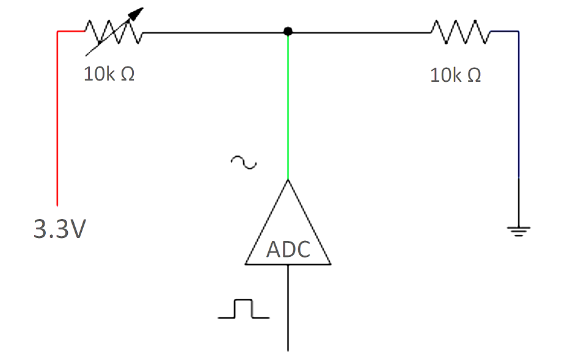
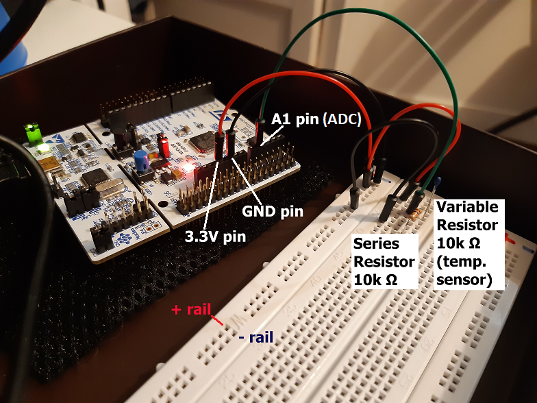

# Embedded Systems Bare-Metal STM32 Programming from the Ground Up: Program 9

[Code Development follows this Udemy Course](https://www.udemy.com/course/embedded-systems-bare-metal-programming/)

## Specs

Host

* MS Windows 10.0.19042
* STM32CubeIDE 1.8.0
* RealTerm 2.0.0.70

Device

* STM32F401RE chip
* STM32 Nucleo-64 development board

## Description

This program demonstrates how to convert a sensor's analog signal to a digital signal.

We use a temperature sensor (variable resistor) to provide our input analog signal.

## Design

Schematic Diagram of Input Sensor

Breadboard Circuit connected to Nucleo-64

## Output

### Video of Debugger

